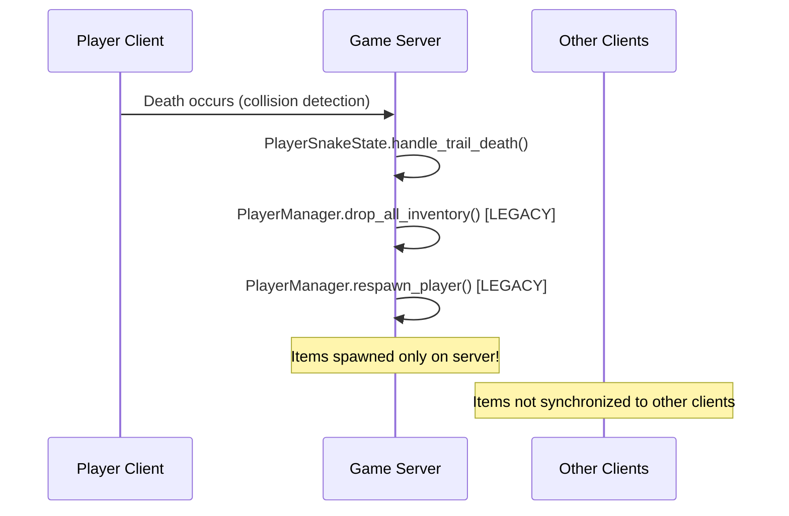

# Research: Snake-Mode Death Item Synchronization Issue

**Date**: February 5, 2026  
**Issue**: Items dropped by dying players in snake-mode only appear for the client, not all connected players

## Root Cause Analysis

### Core Problem Identified

The issue stems from **conflicting dual item drop systems** that operate independently:

1. **DeathSystem.gd** (Modern): Server-authoritative with proper RPC synchronization
2. **PlayerManager.gd** (Legacy): Direct scene manipulation without RPC calls

### Investigation Findings

#### Current Death Flow in Snake Mode



#### Problem Location

**File**: `/home/james/dungeon-master-dad/player/scripts/player_snake_state.gd`  
**Lines**: 140-143

```gdscript
func handle_trail_death(death_pos: Vector2) -> void:
    var pid = owner.get_multiplayer_authority()
    PlayerManager.drop_all_inventory(pid, death_pos)  # ← PROBLEM: No RPC sync
    PlayerManager.respawn_player(pid)                 # ← Uses legacy system
```

#### Why Items Don't Appear for All Players

**PlayerManager.drop_all_inventory()** calls `create_dropped_item_pickups()` which:

1. Tries to find `MultiplayerSpawner` for synchronization
2. Falls back to direct scene manipulation when spawner isn't found  
3. **Only creates items on server** - other clients never receive notification

**Evidence from PlayerManager.gd lines 192-194**:
```gdscript
print("WARNING: MultiplayerSpawner not available, using fallback direct creation")
print("DEBUG: This means pickups will only appear on server!")
```

## Solution Research

### Decision: Consolidate to DeathSystem.gd (Server-Authoritative)

**Rationale**: DeathSystem.gd already implements proper multiplayer synchronization:
- Server-authoritative validation
- Reliable RPC calls for critical events  
- Proper client notification with `notify_items_dropped.rpc()`
- Established respawn delay and reality zone spawning

### Alternatives Considered

#### Option A: Fix PlayerManager MultiplayerSpawner Detection
- **Rejected**: Maintains dual systems, increases complexity
- **Issues**: PlayerManager logic is overly complex with multiple fallback strategies

#### Option B: Update PlayerManager RPC Calls  
- **Rejected**: Legacy system has performance issues and unclear responsibilities
- **Issues**: Creates two authoritative systems for death handling

#### Option C: Hybrid Approach (Current DeathSystem + PlayerManager Cleanup)
- **Rejected**: Leads to race conditions and sync issues
- **Issues**: Two systems modifying inventory simultaneously

### Chosen Approach: Route Snake Deaths Through DeathSystem

**Benefits**:
- Single authoritative system for all death handling
- Proven RPC synchronization already working
- Consistent with other death triggers (non-snake deaths)
- Maintains server authority model
- Respects established performance constraints

### Decision: Reality Zone Respawn Management
**Rationale**: Use existing zone system with designated spawn points. Server selects spawn point using round-robin or distance-based algorithm to avoid clustering.

**Pattern**:
- RealityZone maintains array of spawn points (Vector2 positions)
- Server queries available spawn points on player death
- Spawn point selection considers: availability, distance from other players, map boundaries
- Server sends respawn position via reliable RPC to specific client

**Alternatives considered**:
- Random position within zone bounds (rejected: could spawn players in obstacles)
- Client-selected respawn location (rejected: violates server authority principle)

### Decision: Respawn Delay Implementation
**Rationale**: Use Godot Timer node on server-side to enforce delay. Client receives death notification immediately but respawn is delayed server-side.

**Implementation**:
```gdscript
# Server-side in DeathSystem.gd
func handle_death_with_delay(player_id: int):
    var delay_timer = Timer.new()
    delay_timer.wait_time = RESPAWN_DELAY_SECONDS
    delay_timer.one_shot = true
    delay_timer.timeout.connect(_respawn_player.bind(player_id))
    add_child(delay_timer)
    delay_timer.start()
```

**Alternatives considered**:
- Client-side delay with honor system (rejected: can be bypassed by modified clients)
- Server polling delay (rejected: inefficient compared to timer-based approach)

### Decision: Signal Architecture for Death Events
**Rationale**: Use SignalBus singleton to maintain loose coupling between death system, inventory, respawn, and UI systems.

**Signals to Add**:
```gdscript
# In SignalBus.gd
signal player_death_occurred(player_id: int, position: Vector2)
signal items_dropped(items: Array[DroppedItem], position: Vector2)
signal player_respawn_started(player_id: int, delay: float)
signal player_respawned(player_id: int, new_position: Vector2)
```

**Alternatives considered**:
- Direct method calls between systems (rejected: creates tight coupling)
- Godot Groups for notifications (rejected: less flexible than signals)

### Decision: State Machine Integration
**Rationale**: Enhance existing PlayerDeathState to handle item dropping and create PlayerRespawnWaitState for delay period.

**State Flow**:
1. PlayerIdleState → PlayerDeathState (on death)
2. PlayerDeathState.Enter() → drop items, notify server
3. PlayerDeathState → PlayerRespawnWaitState (server initiates delay)
4. PlayerRespawnWaitState → PlayerIdleState (after delay, at reality zone)

**Alternatives considered**:
- Single death state handling entire flow (rejected: violates single responsibility)
- Skip state machine for death (rejected: breaks established architecture patterns)

## Performance Considerations

### Item Drop Optimization
- Limit maximum items dropped per death (prevent spam)
- Use object pooling for DroppedItem scenes
- Batch RPC calls when multiple players die simultaneously

### Network Traffic Management
- Use reliable RPCs only for critical events (death, respawn)
- Compress item data in RPC payloads (item type IDs instead of full objects)
- Implement RPC call rate limiting to prevent abuse

### Memory Management
- Clean up Timer nodes after respawn completion
- Remove DroppedItem scenes after pickup or timeout
- Use weak references for temporary death event data

## Integration Points

### Existing Systems Integration
- **PlayerManager**: Add death event coordination methods
- **Inventory System**: Extend with networked drop functionality  
- **Zone System**: Add spawn point management to RealityZone
- **Pickup System**: Enhance for multiplayer item collection

### New Systems Required
- **DeathSystem.gd**: Centralized death event coordination
- **SpawnManager.gd**: Reality zone spawn point management
- **DroppedItem.gd**: Networked item representation
- **PlayerRespawnWaitState.gd**: State for respawn delay period

## Testing Strategy

### Multiplayer Test Scenarios
1. **Item Synchronization Test**: Player A dies while Player B observes - verify items appear for both
2. **Respawn Location Test**: Player dies outside reality zone - verify respawn inside zone
3. **Timing Test**: Measure respawn delay matches configured duration
4. **Stress Test**: Multiple simultaneous deaths - verify system handles load
5. **Network Failure Test**: Client disconnects during respawn delay - verify cleanup

### Manual Testing Protocol
- Use playground.tscn with server + 2-3 client instances
- Test each priority user story independently (P1, P2, P3)
- Verify edge cases: no spawn points available, inaccessible death locations
- Performance monitoring during death events

## Implementation Risks & Mitigations

### Risk: RPC Call Failures
**Mitigation**: Implement retry logic for critical RPCs, fallback to local prediction for UI feedback

### Risk: Spawn Point Exhaustion  
**Mitigation**: Implement spawn point recycling, emergency spawn locations outside reality zone if needed

### Risk: Timer Memory Leaks
**Mitigation**: Proper Timer cleanup in _exit_tree(), use WeakRef for player references in timer callbacks

### Risk: Item Duplication
**Mitigation**: Server-side item validation, unique network IDs for all DroppedItems, client-side duplicate prevention