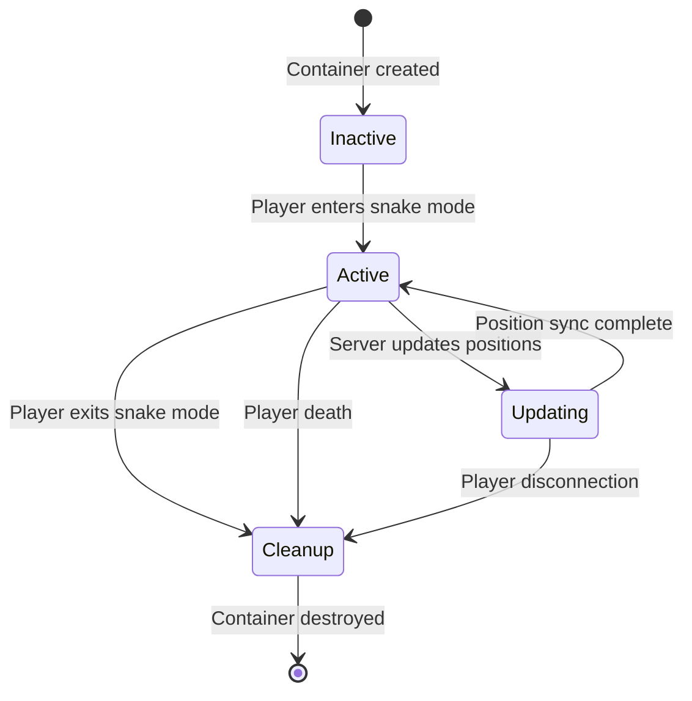
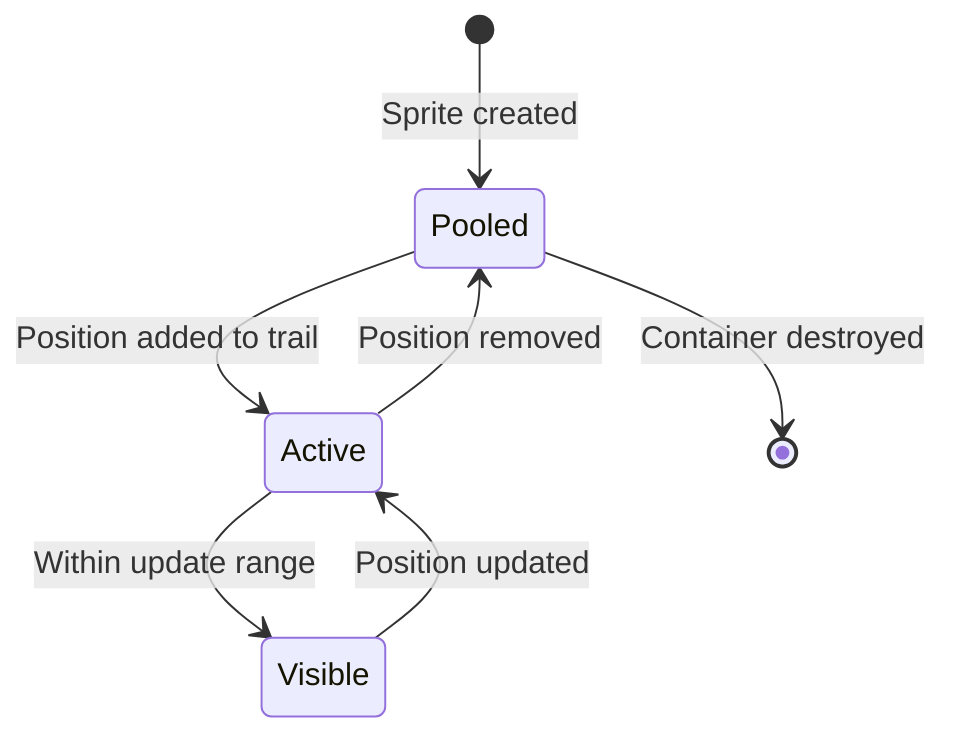

# Data Model: Snake Trail Synchronization

## Core Entities

### SnakeTrailContainer
**Purpose**: Server-authoritative container that manages trail segments for a single player using MultiplayerSynchronizer

**Properties**:
```gdscript
class_name SnakeTrailContainer
extends Node2D

# Synchronized properties (automatically replicated)
@export var trail_positions: Array[Vector2] = []
@export var trail_count: int = 0
@export var player_id: int = -1
@export var max_segments: int = 50

# Local properties (not synchronized)
var sprite_pool: Array[Sprite2D] = []
var collision_pool: Array[StaticBody2D] = []
var active_sprites: Array[Sprite2D] = []
var active_collisions: Array[StaticBody2D] = []
```

**Relationships**:
- Parent: Game world scene (1:N)  
- Children: Trail segment sprites (1:N)
- Authority: Server (ID 1)
- Synchronizer: MultiplayerSynchronizer child node

### TrailSegmentSprite  
**Purpose**: Visual representation of a trail segment with collision detection

**Properties**:
```gdscript
class_name TrailSegmentSprite
extends Node2D

@export var segment_index: int = -1
@export var owner_player_id: int = -1
@export var collision_radius: float = 6.0

@onready var sprite: Sprite2D = $Sprite2D
@onready var collision_body: StaticBody2D = $CollisionBody2D
```

**Validation Rules**:
- `segment_index >= 0` and `< max_segments`
- `owner_player_id` must match container's `player_id`
- `collision_radius > 0`

### MultiplayerSynchronizer Configuration
**Purpose**: Automatic replication of trail position data from server to clients

**Replication Properties**:
```gdscript
# SceneReplicationConfig setup
var config = SceneReplicationConfig.new()

# Position array - high frequency, unreliable for performance
config.add_property(".:trail_positions", {
    "replication_mode": MultiplayerSynchronizer.REPLICATION_MODE_ON_CHANGE,
    "spawn": true,
    "sync": true,
    "reliability": MultiplayerPeer.TRANSFER_MODE_UNRELIABLE_ORDERED
})

# Trail count - reliable updates
config.add_property(".:trail_count", {
    "replication_mode": MultiplayerSynchronizer.REPLICATION_MODE_ON_CHANGE, 
    "spawn": true,
    "sync": true,
    "reliability": MultiplayerPeer.TRANSFER_MODE_RELIABLE
})

# Player ID - spawn only
config.add_property(".:player_id", {
    "replication_mode": MultiplayerSynchronizer.REPLICATION_MODE_SPAWN,
    "spawn": true,
    "sync": false
})
```

## State Transitions

### Trail Container Lifecycle



### Segment Management States



## Data Flow Architecture

### Server Authority Flow
1. **Input**: Player movement in snake mode
2. **Processing**: Server calculates new trail positions  
3. **Storage**: Updates `trail_positions` array in container
4. **Sync**: MultiplayerSynchronizer automatically replicates to clients
5. **Rendering**: Clients update sprite positions from synchronized data

### Position Update Cycle
```gdscript
# Server-side update cycle (20Hz)
func _physics_process(delta: float):
    if not multiplayer.is_server():
        return
    
    # Calculate new trail positions based on player movement
    update_trail_logic(delta)
    
    # MultiplayerSynchronizer handles replication automatically
    # No manual RPC calls needed
```

### Client Synchronization
```gdscript
# Client-side response to synchronized changes
func _on_trail_positions_changed():
    # Called automatically when server updates positions
    update_sprite_positions()
    manage_sprite_visibility()
```

## Performance Optimizations

### Sprite Pool Management
**Pooled Objects**: Pre-created sprites and collision bodies to avoid instantiation overhead

**Pool Sizing**:
- Initial pool size: `max_segments + 10` 
- Growth strategy: Double pool size when depleted
- Shrink strategy: Remove excess sprites after 60 seconds of inactivity

### Update Frequency Optimization
**Distance-Based LOD**:
```gdscript
func calculate_update_frequency(camera_distance: float) -> float:
    if camera_distance < 500.0:
        return 20.0  # High frequency for nearby trails
    elif camera_distance < 1000.0:
        return 10.0  # Medium frequency  
    else:
        return 5.0   # Low frequency for distant trails
```

### Memory Management
**Cleanup Rules**:
- Sprites beyond `max_segments` automatically returned to pool
- Collision bodies cleaned up with sprites
- Container destroyed when player exits snake mode
- Force cleanup on player disconnection

## Integration Contracts

### SnakeState Integration
```gdscript
# Modified PlayerSnakeState interface
class_name PlayerSnakeState extends PlayerState

var trail_container: SnakeTrailContainer

func Enter():
    # Create container on server
    if multiplayer.is_server():
        create_trail_container()

func Process(delta: float):
    # Update container positions (server only)
    if multiplayer.is_server() and trail_container:
        trail_container.update_trail_positions(player.global_position)
```

### TrailManager Integration  
```gdscript
# Modified TrailManager interface
extends Node

var active_containers: Dictionary = {}  # player_id -> SnakeTrailContainer

func create_player_trail_container(player_id: int) -> SnakeTrailContainer:
    # Server creates new container
    var container = snake_trail_container_scene.instantiate()
    container.player_id = player_id
    world_node.add_child(container)
    active_containers[player_id] = container
    return container

func cleanup_player_trail(player_id: int):
    # Remove container and all associated sprites
    if active_containers.has(player_id):
        active_containers[player_id].queue_free()
        active_containers.erase(player_id)
```

## Validation & Constraints

### Network Validation
- Server validates all position updates before synchronization
- Client changes to synchronized properties are ignored
- Authority checks prevent unauthorized updates

### Performance Constraints
- Maximum 50 segments per trail to prevent memory issues
- Update frequency limited by distance to prevent bandwidth waste
- Sprite pool size capped to avoid excessive memory usage

### Collision Detection Preservation
- Each active sprite maintains collision body for gameplay
- Collision layer/mask settings preserved from current system
- Grace period collision detection continues to work with pooled sprites