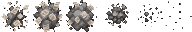

# US-002: Reality Zone tile art drift

**Status**: Draft  
**Source**: `ideas.md` — reality zone  
**Priority**: P2  
**Roles**: Paper Pusher, Dungeon Master

## User Story

As a player in the match, I see **outside** tiles in Reality-claimed area (home rectangle or Reality pocket) slowly and randomly change to their Reality grass/dirt art so that mundane lawn, dirt, paper, and grey overwrite fantasy-element overworld ground.

## Context

Outside tiles (grass and dirt, distinct from dungeon stone) are specified in US-023. Reality coverage is rectangular homes plus pockets (US-001), not a circle.

This story restyles **outside tiles only**. Reality presentation is mundane grass/dirt with office-world details: paper scraps, grey/monochrome wear, mowed lawn — not sparkles, blood, or saturated fantasy color. It does **not** turn dungeon floors into paper, and it does **not** paint grass into the dungeon.

Fantasy art drift is US-004. Occupancy rules are US-001. Catalog membership is US-023. Drift uses the same Reality/Fantasy **claim** as occupancy, including pocket override.

## Independent Test

Cover a mix of outside grass/dirt cells and dungeon floor cells with the Reality home rectangle. Outside cells stagger-convert to Reality-element grass/dirt; dungeon cells keep dungeon catalog art. Spawn a Reality pocket over Fantasy-looking grass: those cells become eligible for Reality drift for the pocket duration; when it expires they become eligible for Fantasy drift again if Fantasy still claims them.

## Acceptance Criteria

1. **Given** an **outside** tile (grass or dirt, US-023) whose center is Reality-claimed (US-001 home or pocket), not inside dungeon bounds, and that is still showing Fantasy or Neutral presentation, **When** enough time passes, **Then** that tile eventually presents its Reality-element variant of the same ground kind.
2. **Given** many eligible outside tiles in Reality-claimed area, **When** drift is running, **Then** they do not all swap on the same frame: conversion is staggered and randomized per tile.
3. **Given** an outside tile that is not Reality-claimed and not Fantasy-claimed, **When** time passes, **Then** its art does not start converting to Reality presentation.
4. **Given** an outside tile that has already converted to Reality presentation, **When** it remains Reality-claimed, **Then** it stays on Reality art (it does not flicker back while still claimed).
5. **Given** an outside tile that was Reality art, **When** it is no longer Reality-claimed and becomes Fantasy-claimed, **Then** it becomes eligible for Fantasy drift (US-004) instead; it remains grass or dirt.
6. **Given** Reality presentation is showing on an outside tile, **When** a player looks at it, **Then** fantasy elements (sparkles, blood, vivid dungeon-yard ornament) are gone and the tile reads as mundane grass or dirt with paper and/or grey office wear.
7. **Given** a **dungeon** tile (floor or wall) whose center is Reality-claimed, **When** Reality drift runs, **Then** that tile is not eligible: it does not become an outside tile and does not swap to grass, dirt, or paper-office ground.
8. **Given** a Reality pocket appears over Fantasy-looking outside tiles, **When** drift is eligible, **Then** those tiles schedule Reality drift the same as home coverage; **When** the pocket expires and Fantasy claims them again, **Then** they become eligible for Fantasy drift.

## Functional Requirements

- **FR-001**: Every **outside** grass and dirt variety (US-023) MUST have a Reality-element presentation distinct from its Fantasy-element presentation. Dungeon catalog tiles are not required to have a Reality outside variant.
- **FR-002**: The server MUST schedule Reality drift only for **outside** tiles whose center is Reality-claimed under US-001 (home rectangle or winning Reality pocket) **and** outside dungeon bounds.
- **FR-003**: Drift MUST be gradual at the region scale: each eligible tile converts after a random delay drawn from a configurable range, not as a single instant remap of the whole rectangle or pocket.
- **FR-004**: A tile MUST NOT convert more than once until its owning zone claim changes (including pocket create/expire).
- **FR-005**: Tile art state MUST be host-authoritative and replicated so every peer shows the same variant for a given tile.
- **FR-006**: Drift MUST NOT change collision, walkability, y-sort, or ground kind (grass stays grass, dirt stays dirt).
- **FR-007**: Claim for drift MUST match occupancy: pockets override homes (newer pocket wins). If only **homes** overlap and no pocket covers the tile, the server MUST pick one claim using a deterministic rule (higher covering level wins; ties stay on the current art until a winner exists) and only drift toward that claim.
- **FR-008**: Drift MUST NOT place, replace, or restyle dungeon catalog tiles, and MUST NOT introduce an outside tile inside dungeon bounds (US-023).

## Multiplayer Requirements

- **MR-001**: Tile variant changes MUST originate on the host/server.
- **MR-002**: A client joining mid-match MUST receive the current art variant of every existing **outside** tile, not only future drift events. Dungeon tiles are not restyled by this story.

## Edge Cases

- Home rectangle grows over a large area in one Reality Level spike: new **outside** tiles enter the eligible set and get their own random delays (no freeze). Dungeon cells covered by the same spike still do not drift.
- Tile is exactly on a rectangle edge: use center-point inclusion; on-edge counts as inside. If that center is also in dungeon bounds, the tile is still ineligible.
- A short-lived pocket expires before a scheduled drift fires: cancel that drift; do not apply Reality art after the claim is gone.
- Art assets missing for a variety: that outside tile stays on its current presentation and is reported as a content error; it must not crash or fall back to a dungeon floor sprite.
- Reality-claimed area overlaps the dungeon: occupancy may still apply (US-001); ground art on those cells is not this story.

## Key Entities

- **Outside Tile**: Grass/dirt overworld cell (US-023); the only eligible drift target.
- **Tile Art Variant**: Reality, Fantasy, or Neutral presentation of the same outside ground kind.
- **Drift Delay**: Per-tile random time until conversion after becoming eligible.

## Assumptions

- Neutral is the default for outside tiles never claimed by either zone.
- Exact delay range is tunable; suggested default is 0.5s–8s after a tile becomes eligible.
- This is a visual (and thematic) system; it does not itself raise Reality Level.
- Dungeon interior restyle (paper dungeon stone vs sparkle dungeon stone) is not in this story.

## Out of Scope

- Occupancy, building, and skeleton rules (US-001), including pocket geometry.
- Outside catalog membership and dungeon exclusion (US-023).
- Fantasy art content (US-004), except the shared claim model.

## Required New Art Assets

Ground variants are specified in **US-023** (Reality-element grass/dirt at 128×128). This story does not add a second tile catalog.

| Asset | Dimensions | Match | Notes |
|---|---|---|---|
| Reality drift puff | 32×32 frames, 4–6 frame strip | `pickups/metal/metal_01.png` / small VFX like `spells/fireball/fireball.png` | Grey paper scraps or dust when a tile converts. Optional if the tile swap is already obvious; required if Neutral→Reality is too subtle. |

Reality drift puff (6×32 frames):

