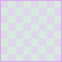

# US-003: Fantasy Zone play space

**Status**: Draft  
**Source**: `ideas.md` — fantasy zone  
**Priority**: P1  
**Roles**: Paper Pusher, Dungeon Master

## User Story

As the Dungeon Master, I hold a rectangular Fantasy home turf that cannot host buildings, and I can create temporary rectangular pockets of Fantasy (for example Bemidji Blizzard), so dungeon creatures have Fantasy-claimed ground — including brief incursions into Reality. Paper Pushers may walk that ground.

## Context

This story defines **occupancy and content rules** for Fantasy. Shape is a design choice: **axis-aligned rectangles by default**, not the current circular `Area2D` radius.

The map has:

- **Home region**: one persistent Fantasy rectangle that grows with Fantasy Level.
- **Pockets**: additional rectangles created by effects, with a duration. While a pocket is live it is Fantasy for every rule in this story.

Bemidji Blizzard (US-017) is the first named Fantasy pocket: the cast area temporarily becomes Fantasy. Paper Pusher Reality pockets are the counterpart (US-001). The Fantasy home (and all pockets) MUST sit inside the **map interior** (US-024); the dungeon sits on the right edge of that interior.

Tile art drift on **outside** tiles is US-004. Reality occupancy is US-001. Dungeon interiors use dungeon tiles (US-023); occupancy still applies if Fantasy covers dungeon or overworld.

**Occupancy addendum (T011):** Paper Pushers walk Fantasy home and pockets. There is no zone wall and no push-out. T005 exclusion/displacement is revoked. Buildings still cannot place. Skeletons still allowed unless Reality-claimed (US-001). DM occupancy is unchanged.

## Independent Test

Grow a rectangular Fantasy home. A Paper Pusher walks in and out of it; they are not stopped and not pushed. The DM walks through it. A building placement whose footprint touches it is rejected. A skeleton can exist inside it (if not Reality-claimed). Cast a Fantasy pocket (blizzard) over Reality home: Paper Pushers in that rectangle stay; new buildings there are rejected; skeletons may exist there; when the pocket expires, Reality home rules return.

## Acceptance Criteria

1. **Given** a Paper Pusher is outside Fantasy-claimed area, **When** they walk into it, **Then** they enter and remain; zone type does not block them (normal collision with walls, buildings, and doodads still applies).
2. **Given** a Paper Pusher is already inside Fantasy (home grew over them, pocket appeared, spawn, knockback), **When** the next physics update runs on the server, **Then** they are not pushed out.
3. **Given** the Dungeon Master approaches Fantasy-claimed area, **When** they move, **Then** they may enter and move freely inside it.
4. **Given** a building footprint that intersects Fantasy-claimed area, **When** placement is requested, **Then** the server rejects it and no building is created.
5. **Given** a skeleton is inside Fantasy-claimed area and is not Reality-claimed (US-001 pocket override), **When** occupancy is evaluated, **Then** the skeleton is allowed to exist and act.
6. **Given** Fantasy does not claim a walkable overworld cell, **When** a Paper Pusher moves there, **Then** this story does not block them.
7. **Given** Fantasy covers dungeon cells, **When** tile catalog is evaluated, **Then** those cells remain dungeon tiles; Fantasy occupancy does not plant outside grass/dirt inside the dungeon (US-023, US-004).
8. **Given** a DM effect that creates a Fantasy pocket (including Bemidji Blizzard, US-017), **When** the effect resolves, **Then** a rectangular Fantasy region appears for a finite duration and all occupancy rules in this story apply inside it, including over ground that was Reality home.
9. **Given** a live Fantasy pocket expires, **When** the next occupancy pass runs, **Then** that rectangle is no longer Fantasy by itself; remaining home/pocket coverage is re-evaluated (existing buildings are not auto-destroyed; Paper Pushers already there stay).

## Functional Requirements

- **FR-001**: Fantasy coverage MUST be the union of the Fantasy **home region** and all live Fantasy **pockets**. Default region shape is an **axis-aligned rectangle** (optionally snapped to the tile grid). Circles MUST NOT be the default.
- **FR-002**: The home region MUST persist for the match and MUST grow as Fantasy Level increases (suggested: expand width and/or height, or each edge, by a configurable amount per level). Occupancy MUST use the live rectangle, not the size at session start. Growth MUST clip to the map interior (US-024); the home MUST NOT cross the cliff ring. Suggested start: covering or abutting the **east** dungeon AABB.
- **FR-003**: Effects MAY create Fantasy pockets: extra rectangles with an origin, size, and duration. Bemidji Blizzard MUST create one (US-017). Other DM effects MAY use the same contract.
- **FR-004**: While a pocket is live, every point inside it MUST be treated as Fantasy for movement, building, skeletons, and (via US-004) tile claim, **even if a Reality home region also covers that point**. Pockets override homes. If two pockets overlap, the **newer** pocket wins (same rule as US-001 FR-004).
- **FR-005**: Paper Pushers MUST be allowed to path and occupy walkable Fantasy-claimed cells (home or pocket). There MUST NOT be a Fantasy zone wall. There MUST NOT be a push-out because they are in Fantasy.
- **FR-006**: The Dungeon Master MUST be able to enter and remain inside Fantasy-claimed area.
- **FR-007**: Building placement MUST be rejected if any part of the footprint intersects Fantasy-claimed area.
- **FR-008**: Skeletons MUST be permitted inside Fantasy-claimed area unless that point is Reality-claimed under US-001 (Reality pocket override, or Reality skeleton ban).
- **FR-009**: This story MUST NOT displace a Paper Pusher for being in Fantasy-claimed area. T005 exclusion/push-out is revoked (T011).
- **FR-010**: Home overlap is US-025 (homes never share cells). Buildings MUST still be rejected in Fantasy. Skeletons MUST still be removed if Reality-claimed (US-001). Paper Pusher movement MUST NOT be blocked by Fantasy claim.

## Multiplayer Requirements

- **MR-001**: Home rectangle, pocket set, building reject, and skeleton allow/ban MUST be enforced on the host/server. Clients MUST NOT locally wall or shove Paper Pushers out of Fantasy.
- **MR-002**: All peers MUST observe the same Fantasy home rectangle, the same live pockets, and the same building/skeleton occupancy.

## Edge Cases

- Fantasy home grows over a Paper Pusher: they stay; no displacement.
- Fantasy pocket appears under several Paper Pushers: they stay.
- DM is inside Fantasy; a Paper Pusher attacks from inside or outside: this story does not define combat reach (weapons in US-005).
- Buildings already placed when Fantasy (home or pocket) later covers them: they are not auto-destroyed by this story; they cannot be repaired/expanded into Fantasy; production is not stopped by occupancy alone (blizzard slow is US-017).
- Fantasy overlaps dungeon bounds: Paper Pushers may walk those cells if walkable; ground stays dungeon catalog, not grass/dirt.
- Pocket whose rectangle is degenerate or zero-size: treat as no pocket.
- Entire-map Fantasy is not a game-over in this story.

## Key Entities

- **Fantasy Home Region**: Persistent axis-aligned rectangle that grows with Fantasy Level.
- **Fantasy Pocket**: Temporary rectangle of Fantasy created by an effect (e.g. Bemidji Blizzard).
- **Fantasy Claim**: A point is Fantasy-claimed if a live Fantasy pocket covers it and wins overlap, or else the Fantasy home covers it (homes are exclusive per US-025).
- **Fantasy Level**: Shared DM progression value that expands the home region and gates dungeon power.

## Assumptions

- One Fantasy home region exists per match.
- Generated dungeon interior is expected to sit inside or become covered by the Fantasy home as Fantasy Level rises; the dungeon is placed on the right map edge (US-024). Dungeon generation itself is unchanged here except for world origin.
- Overworld cells under Fantasy are outside tiles (US-023); dungeon cells are not.

## Out of Scope

- Fantasy art drift on outside grass/dirt (US-004).
- Outside vs dungeon catalog membership (US-023).
- Reality home and Reality pockets (US-001).
- Skeleton death outside dungeon bounds (keep unless it conflicts).
- DM dungeon start/exit (US-015).
- Blizzard slow amounts and unlock (US-017); this story only requires that the cast area is a Fantasy pocket.
- Map cliff geometry and overworld fill (US-024).
- Game over when one zone covers the map.

## Required New Art Assets

Pixel art, same 3/4 camera as dungeon tiles. Overlays are **128×128** tileable cells like `sprites/cubicle_stone_floor.png`.

| Asset | Dimensions | Match | Notes |
|---|---|---|---|
| Fantasy home overlay | 128×128, tileable | Floor cell size; saturated greens/purples, sparkle flecks | Semi-transparent wash. Not dungeon stone. |
| Fantasy pocket overlay | 128×128, tileable | Same cell size; frost/sparkle border | Distinct from home wash. Blizzard (US-017) may tint this icy, but the pocket still needs a readable Fantasy shape. |

Fantasy home overlay (tileable wash):

Fantasy pocket overlay (frost/sparkle border):

