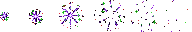

# US-004: Fantasy Zone tile art drift

**Status**: Draft  
**Source**: `ideas.md` — fantasy zone  
**Priority**: P2  
**Roles**: Dungeon Master, Paper Pusher

## User Story

As a player in the match, I see **outside** tiles in Fantasy-claimed area (home rectangle or Fantasy pocket) slowly and randomly change to their Fantasy grass/dirt art so that sparkles, blood, and saturated color visibly overtake mundane lawn and grey dirt.

## Context

Paired with US-002. Same **outside** tiles (US-023), opposite presentation. Fantasy coverage is rectangular homes plus pockets (US-003), not a circle. Fantasy presentation is grass/dirt with sparkles, blood, mushrooms, and vibrant color. Reality presentation is paper/grey mundane yard. Dungeon floors and walls are a different catalog and are not restyled into lawn.

Occupancy is US-003. Catalog membership is US-023. Drift uses the same claim as occupancy, including pocket override (e.g. Bemidji Blizzard, US-017).

## Independent Test

Cover a mix of outside grass/dirt cells and dungeon floor cells with the Fantasy home rectangle. Outside cells stagger-convert to Fantasy-element grass/dirt; dungeon cells keep dungeon catalog art. Cast a Fantasy pocket over Reality-looking grass: those cells become eligible for Fantasy drift for the pocket duration; when it expires they become eligible for Reality drift again if Reality still claims them.

## Acceptance Criteria

1. **Given** an **outside** tile whose center is Fantasy-claimed (US-003 home or pocket), not inside dungeon bounds, not inside a winning Reality claim, and not already on Fantasy presentation, **When** enough time passes, **Then** that tile presents its Fantasy-element variant of the same ground kind.
2. **Given** many eligible outside tiles, **When** drift is running, **Then** conversions are staggered and randomized per tile, not a single-frame remap of the whole rectangle or pocket.
3. **Given** an outside tile that is not Fantasy-claimed, **When** time passes, **Then** it does not start converting to Fantasy presentation because of this zone.
4. **Given** Fantasy presentation is showing on an outside tile, **When** a player looks at it, **Then** it reads as grass or dirt with sparkles, blood, and/or vibrant fantasy color rather than paper or grey office yard.
5. **Given** an outside tile on Fantasy art, **When** Fantasy no longer claims it and Reality does, **Then** it becomes eligible for Reality drift (US-002); it remains grass or dirt.
6. **Given** an outside tile on Fantasy art that remains Fantasy-claimed, **When** time passes, **Then** it does not flicker back to Neutral or Reality.
7. **Given** a **dungeon** tile whose center is Fantasy-claimed, **When** Fantasy drift runs, **Then** that tile is not eligible: it does not become an outside tile and does not swap to grass or dirt.
8. **Given** a Fantasy pocket (e.g. blizzard) appears over Reality-looking outside tiles, **When** drift is eligible, **Then** those tiles schedule Fantasy drift the same as home coverage; **When** the pocket expires and Reality claims them again, **Then** they become eligible for Reality drift.

## Functional Requirements

- **FR-001**: Every **outside** grass and dirt variety (US-023) MUST have a Fantasy-element presentation distinct from its Reality-element presentation. Dungeon catalog tiles are not required to have a Fantasy outside variant.
- **FR-002**: The server MUST schedule Fantasy drift only for **outside** tiles whose center is Fantasy-claimed under US-003 (home rectangle or winning Fantasy pocket), outside dungeon bounds, and not Reality-claimed (same claim model as US-002 FR-007).
- **FR-003**: Drift MUST use a per-tile random delay from a configurable range.
- **FR-004**: Drift MUST NOT change collision, walkability, y-sort, or ground kind (grass stays grass, dirt stays dirt).
- **FR-005**: Tile art state MUST be host-authoritative and replicated, including to late-joining clients.
- **FR-006**: Reality and Fantasy drift MUST share one claim state per outside tile so the two systems cannot fight frame-to-frame.
- **FR-007**: Drift MUST NOT place, replace, or restyle dungeon catalog tiles, and MUST NOT introduce an outside tile inside dungeon bounds (US-023).

## Multiplayer Requirements

- **MR-001**: Variant changes MUST originate on the host/server.
- **MR-002**: Late joiners MUST receive current variants for all tiles.

## Edge Cases

- Home rectangles grow over the same **outside** tiles in one frame: apply the shared claim-winner rule once, then schedule at most one drift.
- A short-lived pocket expires before a scheduled drift fires: cancel that drift; do not apply Fantasy art after the claim is gone.
- Fantasy-claimed area overlaps the dungeon: occupancy may still apply (US-003); dungeon cells stay dungeon tiles and do not become grass/dirt.
- Missing Fantasy art for a variety: keep current outside presentation; do not crash or fall back to a dungeon floor sprite.

## Key Entities

- **Outside Tile**: Grass/dirt overworld cell (US-023); the only eligible drift target.
- **Tile Art Variant**: Reality, Fantasy, or Neutral presentation of the same outside ground kind.
- **Zone Claim**: Which zone currently owns an outside tile for drift purposes.

## Assumptions

- Suggested delay range matches US-002 (0.5s–8s) unless tuned separately.
- Sparkle/blood overlays are part of the Fantasy **outside** presentation, not a dungeon floor overlay.

## Out of Scope

- Occupancy rules (US-003), including pocket geometry.
- Outside catalog membership and dungeon exclusion (US-023).
- Reality art content (US-002), except the shared claim model.
- Dungeon interior art.
- Blizzard slow (US-017); this story only restyles tiles in the Fantasy claim.

## Required New Art Assets

Ground variants are specified in **US-023** (Fantasy-element grass/dirt at 128×128). This story does not add a second tile catalog.

| Asset | Dimensions | Match | Notes |
|---|---|---|---|
| Fantasy drift puff | 32×32 frames, 4–6 frame strip | `spells/fireball/fireball.png` scale; sparkle language like `sprites/sparks.png` (that file is 28×4 and too small to reuse) | Sparkle/blood flecks when a tile converts. |

Fantasy drift puff (6×32 frames):

