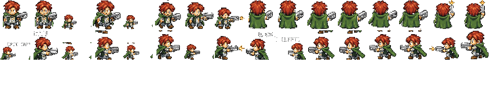
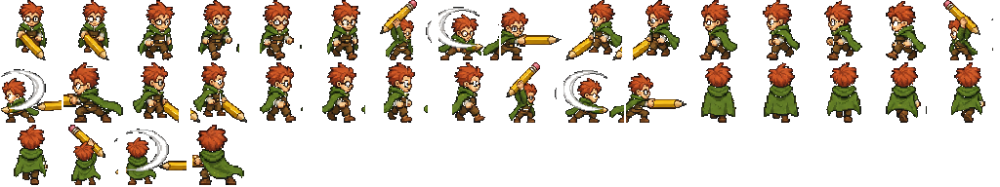

# US-005: Paper Pusher combat loadout

**Status**: Draft  
**Source**: `ideas.md` — Paper Pushers  
**Priority**: P1  
**Roles**: Paper Pusher

## User Story

As a Paper Pusher, I fight with a staple gun as my primary weapon and a huge pen or pencil as my melee weapon so that office supplies are how I contest monsters and the Dungeon Master.

## Context

Players already have a melee attack (`attack_hurtbox`, `melee_damage`) driven by the player state machine. There is no ranged weapon, no ammo, and no distinct melee item identity.

Staple restock is US-010. The late-game chainsaw is US-022 and replaces or temporarily overrides this loadout when active.

## Independent Test

Control a Paper Pusher with staples in magazine: fire the staple gun at a dummy and see projectile damage. Empty the magazine and confirm it cannot fire. Switch to or stand in melee range with the pen/pencil and confirm a melee hit. Both attacks replicate to a second peer.

## Acceptance Criteria

1. **Given** a Paper Pusher has at least one staple loaded, **When** they press the primary-fire control, **Then** they fire a staple projectile in the aiming direction and the magazine decreases by one.
2. **Given** the magazine is empty, **When** they press primary fire, **Then** no projectile is created and an empty-click / jam feedback plays.
3. **Given** a staple projectile overlaps a valid hurtbox (monster, DM, or other damageable), **When** the hit is resolved on the server, **Then** damage is applied once and the projectile is consumed.
4. **Given** a Paper Pusher is in melee range of a valid target, **When** they press the melee control, **Then** they swing the huge pen or pencil and deal melee damage on a successful hurtbox overlap.
5. **Given** melee is used, **When** the attack plays, **Then** it does not consume staples.
6. **Given** another peer is watching, **When** either attack is used, **Then** they see the same firing/swing and the same damage outcome.
7. **Given** the player is dead, building, or otherwise in a non-combat state that already blocks attacks, **When** they press fire or melee, **Then** neither attack occurs.

## Functional Requirements

- **FR-001**: Each Paper Pusher MUST have a staple magazine with a configurable max size (suggested default 20).
- **FR-002**: Primary fire MUST spawn a server-validated staple projectile that travels in the player's facing/aim direction, deals configurable damage, and is destroyed on first valid hit or on leaving a max range.
- **FR-003**: Primary fire MUST consume exactly one staple per shot when the magazine has ammo, and MUST NOT fire when empty.
- **FR-004**: Melee MUST use a distinct huge pen or pencil attack (animation and hurtbox), dealing configurable melee damage without spending staples.
- **FR-005**: The player MUST be able to use melee even when the staple gun is empty.
- **FR-006**: Hit detection and damage MUST be host-authoritative; clients may predict visuals.
- **FR-007**: Magazine count MUST be tracked per player, shown on the Paper Pusher HUD, and replicated to that player's client.
- **FR-008**: Staple projectiles MUST collide with walls and not pass through them.

## Multiplayer Requirements

- **MR-001**: Fire and melee input may originate on the owning client; the host/server MUST validate range, ammo, and hits.
- **MR-002**: Ammo must not desync: a client MUST NOT be able to fire more staples than the server magazine allows.
- **MR-003**: Projectile spawns MUST replicate to all peers (existing projectile spawner pattern).

## Edge Cases

- Fire pressed on the same frame the last staple is spent: exactly one shot, magazine goes to 0.
- Melee and fire on the same frame: one wins by a deterministic priority (melee interrupts unfired shot; do not spend a staple if melee wins).
- Staple hits a building: no damage unless a later story says otherwise (US-011 goblins damage buildings, not staples by default).
- Aiming at the DM inside overlapping zones: combat is allowed; zone rules do not cancel damage.

## Key Entities

- **Staple Gun**: Ranged primary weapon.
- **Staple**: Consumable ammo unit in a per-player magazine.
- **Huge Pen/Pencil**: Melee weapon, always available on the default loadout.

## Assumptions

- Pen vs pencil is a cosmetic/loadout skin, not two different damage models, unless art direction later splits them.
- Suggested staple damage is 1 per hit; suggested melee damage stays at the current player `melee_damage` default unless tuned.
- Reload is not done from inventory; restock is US-010 (Office Max).

## Out of Scope

- Office Max restock (US-010).
- Pull-start chainsaw (US-022).
- Harvest tools (US-006, US-007) — harvesting may reuse melee input but is a different action.

## Required New Art Assets

The current Paper Pusher sheet (`player/sprites/PlayerSprite02.png`) is a **64×64** frame grid with a sword. Office weapons need new frames at that same size and 4-direction layout. Do not stretch the sword into a pen.

| Asset | Dimensions | Match | Notes |
|---|---|---|---|
| Player + staple gun sheet | 64×64 frames (idle / walk / shoot, 4 dir) | `player/sprites/PlayerSprite02.png` (1024×192, 64×64 cells) | Same cape/body; staple gun instead of sword. |
| Staple projectile | 32×32 | `pickups/metal/metal_01.png`, `spells/fireball/fireball.png` | Single metal staple, readable in flight. |
| Player + huge pen/pencil melee sheet | 64×64 frames (idle / walk / swing, 4 dir) | Same player sheet layout | Oversized office pen or pencil as the melee weapon. Pen vs pencil may be a palette swap. |
| Melee swing VFX | 64×64 frames | `sprites/AttackSprite01.png` (768×64 slash strip) | Ink/graphite arc instead of a sword slash. |
| Staple HUD icon | 32×32 | `sprites/build_smoke_factory_icon.png` | Magazine / ammo pip on the Paper Pusher HUD. |

Player + staple gun (1024×192, 64×64 cells; row 0 S then N, row 1 E then W, 8 frames per dir idle/walk/shoot):

Player + huge pencil melee (1024×192; packed DOWN/LEFT/RIGHT/UP, idle×2 walk×4 swing×3 per dir):

Staple projectile (32×32):

Melee ink slash (768×64, 12×64 frames):

Staple HUD icon (32×32):

