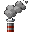

# US-008: Factory economy — smoke power and Reality Level

**Status**: Draft  
**Source**: `ideas.md` — Paper Pushers  
**Priority**: P1  
**Roles**: Paper Pusher

## User Story

As a Paper Pusher, I run smoke factories to accumulate smoke that powers buildings, and I run paper factories that raise Reality Level more than smoke factories do, so that the office expands by industry rather than by combat.

## Context

`SmokeFactory` already adds 1 smoke (capped by `max_smoke_amt`) and +1 Reality Level per interval. `PaperFactory` already consumes 3 smoke and adds +10 Reality Level, but it does not consume wood or emit paper (those are US-006). Smoke is a shared global pool on `PlayerManager`, not per-player.

This story locks the intended economy: smoke is fuel; both factory types raise Reality Level; paper factories raise it more.

## Independent Test

Place a smoke factory in the Reality Zone. Watch smoke and Reality Level tick up. Place a paper factory, supply wood (US-006) and smoke, and confirm each successful paper cycle raises Reality Level by more than one smoke-factory cycle, consumes smoke, and does not run without fuel.

## Acceptance Criteria

1. **Given** an enabled smoke factory in the world, **When** a production interval completes, **Then** shared smoke increases by the configured amount (not past the cap) and Reality Level increases by the smoke-factory amount.
2. **Given** smoke is at cap, **When** a smoke factory interval completes, **Then** smoke stays at cap and Reality Level still increases by the smoke-factory amount.
3. **Given** an enabled paper factory has enough smoke and wood, **When** a production interval completes, **Then** it consumes the configured smoke and wood, produces paper (US-006), and increases Reality Level by the paper-factory amount.
4. **Given** a paper factory lacks smoke or wood, **When** an interval elapses, **Then** it produces nothing and Reality Level does not increase from that factory.
5. **Given** equal interval counts, **When** one paper-factory success is compared to one smoke-factory success, **Then** the paper-factory Reality Level gain is strictly larger.
6. **Given** no factories are enabled, **When** time passes, **Then** smoke does not accumulate from factories and Reality Level does not increase from this system.
7. **Given** other buildings that require smoke to operate (if any besides paper factories), **When** smoke is insufficient, **Then** those buildings do not complete their powered action.

## Functional Requirements

- **FR-001**: Smoke MUST be a shared, host-authoritative pool with a configurable cap (current default cap 5 may be raised if paper factories plus other buildings need more headroom).
- **FR-002**: Smoke factories MUST add smoke and a small Reality Level increase each interval.
- **FR-003**: Paper factories MUST consume smoke (and wood per US-006), produce paper, and add a larger Reality Level increase than a smoke factory interval.
- **FR-004**: Suggested defaults, matching current code unless tuned: smoke factory +1 smoke and +1 Reality; paper factory −3 smoke and +10 Reality.
- **FR-005**: Reality Level increases MUST grow the Reality **home rectangle** (US-001), not a circle.
- **FR-006**: Factory production MUST run only on the server for enabled (non-ghost) buildings.
- **FR-007**: Smoke MUST be spendable fuel for powered buildings; a spend MUST be atomic (check then deduct on the server).
- **FR-008**: Destroyed factories (US-011) MUST stop producing immediately.

## Multiplayer Requirements

- **MR-001**: Smoke amount and Reality Level MUST be identical on every peer.
- **MR-002**: Clients MUST NOT simulate resource grants that the server did not confirm.

## Edge Cases

- Two paper factories tick on the same frame with only 3 smoke: exactly one succeeds; the other waits.
- Reality Level is used elsewhere (HUD, home-region size): all listeners see one monotonic server value.
- Smoke factory interval while the building is being destroyed: no grant after destruction.

## Key Entities

- **Smoke**: Shared fuel resource produced by smoke factories.
- **Smoke Factory**: Low-output Reality engine and smoke producer.
- **Paper Factory**: High-output Reality engine, smoke consumer, paper producer.
- **Reality Level**: Shared expansion currency.

## Assumptions

- Intervals stay per-building (`Building.interval`).
- Paper as an item is specified in US-006; this story owns the Reality Level and smoke-power rules even if paper output is stubbed during implementation.

## Out of Scope

- Forms / tax / IRS (US-009) — those grant additional Reality on top of factories.
- Goblin damage to factories (US-011).
- Fantasy Level (DM side).

## Required New Art Assets

World buildings already exist: smoke factory (`sprites/smoke_factory.png`, 128×128) and paper factory (`sprites/paper-sheet.png`, 100×100 frames). Smoke factory HUD icons exist (`sprites/build_smoke_factory_icon.png`, 32×32). Paper factory HUD currently reuses the smoke icon.

| Asset | Dimensions | Match | Notes |
|---|---|---|---|
| Paper factory build icon | 32×32 normal + pressed | `sprites/build_smoke_factory_icon.png` / `_pressed` | Distinct blue “PAPER FIRM” thumbnail. |
| Smoke resource HUD pip | 32×32 | Same HUD icon size | Smokestack / puff for the shared smoke pool. |

Paper factory build icon (32×32) and pressed:

Smoke HUD pip (32×32):

