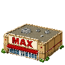

# US-010: Restock staples at Office Max

**Status**: Draft  
**Source**: `ideas.md` — Ammo  
**Priority**: P2  
**Roles**: Paper Pusher

## User Story

As a Paper Pusher, I visit Office Max to restock staples so that my staple gun (US-005) has a map-tied ammo supply instead of infinite fire.

## Context

US-005 introduces a per-player staple magazine. This story is the only intended map restock. Office Max is a normal destructible building with HP (same family as factories / IRS); ruined art shows when it is destroyed. Goblin raids that remove it are US-011.

Restock is **per press**: each successful interact costs **exactly 1 iron** and grants **10 staples**, or fewer if fewer than 10 fit under magazine max. It is **not** a single press that fills the whole magazine for `ceil(refilled/10)` iron.

## Independent Test

Empty the magazine with iron on hand, interact at Office Max once: magazine +10, iron −1. Interact again until full. With 1 room left in the mag, one press grants that remainder for 1 iron. Attempt restock with 0 iron and confirm reject. Attempt restock away from Office Max and confirm it fails. A second Office Max placement is rejected. Destroy the building: ruined art, restock unavailable until rebuilt.

## Acceptance Criteria

1. **Given** a Paper Pusher is in interact range of an enabled Office Max, their magazine is not full, and they have at least 1 iron, **When** they restock, **Then** they spend exactly **1 iron** and gain `min(10, magazine_max - current)` staples (host-authoritative).
2. **Given** the magazine is already full, **When** they restock, **Then** nothing changes and no iron is spent (no-op or "already full" feedback).
3. **Given** the player is not in range of Office Max, **When** they press restock / interact, **Then** the magazine and iron do not change.
4. **Given** the player has 0 iron (and magazine is not full), **When** they restock, **Then** the server rejects it; magazine and iron are unchanged.
5. **Given** Office Max has not been built, **When** a player needs ammo, **Then** there is no other full-restock source from this story.
6. **Given** an Office Max already exists, **When** another Office Max placement is requested, **Then** the server rejects it.
7. **Given** Office Max reaches 0 HP / is destroyed (US-011), **When** destruction resolves, **Then** it shows ruined art and restock is unavailable until it is rebuilt.

## Functional Requirements

- **FR-001**: Office Max MUST be a unique buildable (max one enabled per match), placeable under US-001 / US-003 rules, costing iron to **place** (US-007).
- **FR-002**: Interacting with an enabled Office Max MUST add staples to the interacting player's magazine (US-005) when they can pay the per-press iron cost.
- **FR-003**: Each successful restock interact MUST cost **exactly 1 iron** and MUST grant **10 staples**, or `magazine_max - current` if that remainder is less than 10. Restock MUST be instant or a short channel (suggested default ≤1s). Restock MUST NOT consume paper, wood, or smoke. Filling a larger magazine requires multiple interacts (e.g. 0→20 at max 20 needs two presses and 2 iron).
- **FR-004**: Restock MUST be host-authoritative per player magazine and iron.
- **FR-005**: Office Max MUST NOT refill other players' magazines without their own interact.
- **FR-006**: Office Max MUST have server-side hit points like other buildings (suggested default **16**, same as US-011). It is destructible, not immortal. At 0 HP it is destroyed, shows **ruined** art, and cannot restock until rebuilt.

## Multiplayer Requirements

- **MR-001**: Two players may restock in sequence; each magazine and iron spend is independent.
- **MR-002**: Uniqueness of Office Max MUST be enforced on the server.
- **MR-003**: HP, destruction, ruined presentation, and restock outcomes MUST be host-authoritative.

## Edge Cases

- Player interacts while dying: if the interact completes before death (1 iron spent, staples granted), that outcome sticks on respawn; if not, magazine and iron stay as before the attempt.
- Building ghost/preview is not an enabled Office Max.
- Mag has 3 free slots: one press costs 1 iron and grants 3 staples (not 10).
- Already full: no iron spend.
- 0 iron: reject; no staples granted.
- Do **not** charge `ceil(full_refill/10)` in one press.

## Key Entities

- **Office Max**: Unique restock building with HP and a ruined destroyed state.
- **Staple Magazine**: Per-player ammo from US-005.

## Assumptions

- There is no staple item in inventory; ammo lives on the weapon.
- Placement iron cost (build) is separate from restock iron cost.
- Players press interact repeatedly to top off a large empty magazine.

## Out of Scope

- Staple gun firing (US-005).
- IRS (US-009).
- Goblin raid AI (US-011); this story only requires HP + ruined state + restock gate.
- DM mana (US-014).

## Required New Art Assets

| Asset | Dimensions | Match | Notes |
|---|---|---|---|
| Office Max building | 128×128 | `sprites/smoke_factory.png` | Big-box office supply, 3/4, same cell footprint as dungeon floors. |
| Office Max ruined | 128×128 | Other ruined buildings (e.g. US-011 smoke/IRS rubble); same footprint as live Office Max | Destroyed / 0 HP presentation. |
| Office Max build icon | 32×32 normal + pressed | `sprites/build_smoke_factory_icon.png` | Placement HUD. |
| Staple box (optional world prop) | 32×32 | Pickup icons | Restock feedback; can skip if the building interact is clear without it. |

Office Max building (128×128), ruined (128×128), and build icons. Skipped optional staple box.

