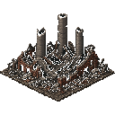
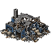

# US-011: Goblins raid and destroy factories

**Status**: Draft  
**Source**: `ideas.md` — monsters  
**Priority**: P2  
**Roles**: Dungeon Master, Paper Pusher

## User Story

As the Dungeon Master, my goblins attack factories and destroy them so that I can tear down the Paper Pushers' Reality engine instead of only fighting their bodies.

## Context

Goblins exist as catalog monsters with aggro/attack states aimed at characters. Buildings exist as enabled scenes under a building root with collision, but they have no health and are not goblin targets. Spawning goblins is already a DM HUD action (currently paid with Fantasy Level; mana is US-014).

## Independent Test

Place a smoke or paper factory. Spawn or walk a goblin into range. The goblin pathfinds to the factory, attacks it, factory HP drops, and at 0 HP the factory is removed and stops producing. A Paper Pusher can kill the goblin first and save the building.

## Acceptance Criteria

1. **Given** an enabled factory (smoke or paper) exists and a living goblin is in the world, **When** the goblin has no higher-priority living character in aggro range, **Then** it acquires a factory as a raid target and moves to attack it.
2. **Given** a goblin is in attack range of its factory target, **When** it completes an attack, **Then** the factory loses HP on the server.
3. **Given** a factory reaches 0 HP, **When** destruction resolves, **Then** the building is removed for all peers, its collision is gone, and it no longer produces smoke, paper, or Reality Level.
4. **Given** a Paper Pusher damages a goblin, **When** the goblin is in raid mode, **Then** it may switch aggro to that Paper Pusher (existing aggro rules) and can return to raiding if the threat drops.
5. **Given** IRS or Office Max is an enabled building, **When** a goblin has no factory target, **Then** it MAY raid those buildings with the same HP rules (unique buildings are not immune).
6. **Given** a factory is a ghost placement preview, **When** goblins search for targets, **Then** they ignore it.

## Functional Requirements

- **FR-001**: Enabled buildings MUST have server-side hit points (suggested default: smoke factory 8, paper factory 12, IRS 20, Office Max 16).
- **FR-002**: Goblins MUST be able to damage buildings with their melee attack.
- **FR-003**: At 0 HP the server MUST despawn/destroy the building and stop all of its production immediately.
- **FR-004**: Goblin targeting MUST prefer factories (smoke and paper) over unique buildings, and unique buildings over wandering with no target.
- **FR-005**: Destroyed buildings MUST refund nothing by default (iron is spent).
- **FR-006**: Building HP MUST be replicated enough for a visible health bar on peers.
- **FR-007**: Monsters other than goblins MUST NOT destroy buildings unless a later story says so.

## Multiplayer Requirements

- **MR-001**: Building HP and destruction MUST be host-authoritative.
- **MR-002**: All peers MUST see the building disappear in the same frame window as other replicated despawns.

## Edge Cases

- Last HP removed in the same frame as a production tick: destruction wins; no production grant.
- Building destroyed while a player is depositing wood: deposit fails, wood stays in inventory.
- No buildings exist: goblins use existing character aggro / wander.

## Key Entities

- **Goblin**: Raid monster.
- **Building HP**: Durability of enabled buildings.
- **Factory**: Smoke or paper factory, primary raid target.

## Assumptions

- Knightlings (US-012) hunt players, not buildings.
- Gremlins (US-013) steal resources, not HP.

## Out of Scope

- How goblins are unlocked or paid for (US-014, US-016).
- Repairing buildings (not in ideas.md).

## Required New Art Assets

Goblins (`monsters/goblin.png`, 64×64 frames) and death puffs (`monsters/DestroySmoke.png`) already exist. Enemy HP bars exist (`monsters/enemy_health_bar.tscn`) and may be reused on buildings.

| Asset | Dimensions | Match | Notes |
|---|---|---|---|
| Smoke factory rubble | 128×128 | `sprites/smoke_factory.png` | Destroyed state; same footprint so debris does not shift y-sort. |
| Paper factory rubble | 100×100 or 128×128 | `sprites/paper-sheet.png` frames (100×100) | Destroyed “PAPER FIRM”; prefer matching the live factory frame size. |
| IRS rubble | 128×128 | `sprites/irs_building.png` | Destroyed civic hall; same footprint as the live IRS. |

Smoke factory rubble (128×128) and paper factory rubble (100×100):

