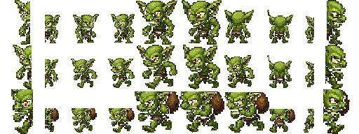

# US-013: Gremlins relocate resources

**Status**: Draft  
**Source**: `ideas.md` — monsters  
**Priority**: P2  
**Roles**: Dungeon Master, Paper Pusher

## User Story

As the Dungeon Master, I spawn gremlins that pick up and move resources around so that I can scatter the office's wood, iron, paper, and forms without having to destroy every factory.

## Context

Gremlin spawn is already a DM HUD action gated on Fantasy Level. There is no gremlin scene behavior that carries items. World pickups and inventories already exist.

This is harassment, not deletion: resources are moved, not destroyed.

## Independent Test

Drop wood (or iron/paper/forms) on the ground. Spawn a gremlin. It walks to a resource, picks it up, carries it, and drops it somewhere else. A Paper Pusher can still recover the pile. The gremlin does not delete the item.

## Acceptance Criteria

1. **Given** a world resource pickup exists (wood, iron, paper, blank form, filled form, tax form), **When** a gremlin has no carried item, **Then** it pathfinds to one and picks it up.
2. **Given** a gremlin is carrying a resource, **When** it travels a configurable distance or time, **Then** it drops the resource as a world pickup at its current position.
3. **Given** a gremlin has dropped an item, **When** it is still alive, **Then** it may acquire another resource.
4. **Given** a Paper Pusher is in range of a dropped resource, **When** they pick it up, **Then** they receive it using the existing pickup/inventory rules.
5. **Given** a gremlin dies while carrying a resource, **When** death resolves, **Then** the resource drops at the gremlin's position and is not lost.
6. **Given** no world resources exist, **When** a gremlin wanders, **Then** it does not pull items out of player inventory by default.
7. **Given** a gremlin is inside the Reality Zone, **When** it relocates items, **Then** it is allowed (gremlins are not skeletons; US-001 does not ban them).

## Functional Requirements

- **FR-001**: Gremlins MUST be able to pick up world resource pickups of the types listed in AC-1.
- **FR-002**: A gremlin MUST carry at most one stack/item instance at a time.
- **FR-003**: Carry MUST end in a drop after a random delay in a configurable range (suggested 2s–6s) or when the gremlin is damaged, whichever the implementation uses consistently; death always drops.
- **FR-004**: Dropped items MUST remain valid pickups with the same item identity and quantity.
- **FR-005**: Gremlins MUST NOT destroy buildings (US-011) and MUST NOT deal lethal executes (US-012).
- **FR-006**: Pickup, carry, and drop MUST be host-authoritative.
- **FR-007**: Gremlins SHOULD prefer resources near factories and the IRS when multiple piles exist.

## Multiplayer Requirements

- **MR-001**: All peers MUST see the same carried vs dropped state for each item.
- **MR-002**: Two gremlins MUST NOT pick up the same item instance.

## Edge Cases

- Player and gremlin grab the same pickup in one frame: server awards it to one actor; the other gets nothing.
- Drop inside Fantasy Zone: Paper Pushers cannot fetch it until it is moved out (US-003). That is allowed and is part of the harassment.
- Inventory-full player trying to reclaim: item stays on the ground (existing full-inventory behavior).

## Key Entities

- **Gremlin**: Resource-relocating monster.
- **Carried Resource**: Item instance held by a gremlin, not in any player inventory.

## Assumptions

- Gremlins do not loot equipped weapons or staple magazines.
- Spawn cost/unlock stays on the DM HUD; payment becomes mana in US-014.

## Out of Scope

- Factory destruction (US-011).
- Knightling kills (US-012).

## Required New Art Assets

The gremlin **HUD** icon exists (`sprites/gremlin_spawn_button.png`, 32×32). The world spawn currently uses `monsters/goblin.tscn` — gremlins need their own body.

| Asset | Dimensions | Match | Notes |
|---|---|---|---|
| Gremlin world sheet | 64×64 frames (idle / walk / pick up / carry) | `monsters/goblin.png` (512×192, 64×64 cells) | Smaller/meaner than the goblin, matching the green HUD face. Carry frames hold a generic 32×32 pickup offset; do not bake every item into the sheet. |

Gremlin world sheet (512×192, 64×64 cells; idle / walk / carry, 4 dir). HUD icon unchanged.

