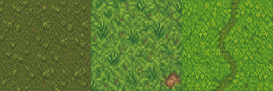
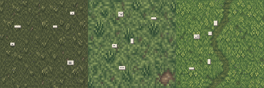
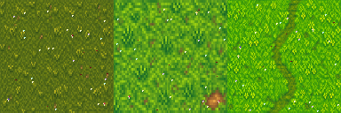
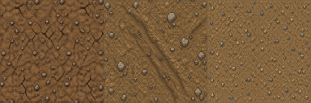
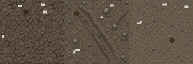
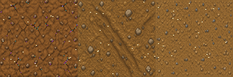

# US-023: Outside tiles (grass and dirt)

**Status**: Draft  
**Source**: new — outside / overworld ground  
**Priority**: P1  
**Roles**: Paper Pusher, Dungeon Master

## User Story

As a player in the overworld, I walk on grass and dirt tiles that are a separate catalog from dungeon stone, so the yard never uses dungeon floors and the dungeon never uses lawn.

## Context

Dungeon generation already places `level/floor.tscn` and `level/wall.tscn` from the dungeon tile catalog (`scripts/procedural_dungeon/tile_catalog.gd`). The overworld around the Reality Zone has no dedicated ground catalog: it is not grass, not dirt, and is not distinguished from dungeon stone.

This story owns **outside tiles** as that catalog. Zone art drift (US-002, US-004) restyles these tiles; it does not convert dungeon floors into lawn or lawn into dungeon stone.

Occupancy (who may stand or build) remains US-001 / US-003. Dungeon start/exit remains US-015. The map interior is filled with these tiles as the **default ground** (US-024): random grass and dirt, Neutral until a zone claims them.

## Independent Test

Stand a Paper Pusher in the Reality Zone overworld: the ground under them is grass and/or dirt from the outside catalog, including more than one variety of each, and some cells show reality-element details while others show fantasy-element details (or Neutral until a zone claims them). Enter a generated dungeon: every dungeon floor/wall is from the dungeon catalog; no grass or dirt cell exists inside dungeon bounds. After generation, no outside tile remains on a dungeon cell.

## Acceptance Criteria

1. **Given** the overworld play space outside dungeon bounds, **When** the match is running, **Then** walkable ground there is made of outside tiles whose ground kind is grass or dirt.
2. **Given** the outside catalog, **When** it is inspected, **Then** it includes multiple grass sprite varieties and multiple dirt sprite varieties (suggested minimum: 3 grass, 3 dirt).
3. **Given** those varieties, **When** they are presented, **Then** some show **reality elements** (mundane lawn/dirt, paper scraps, grey/office wear) and some show **fantasy elements** (sparkles, vivid color, mushrooms, blood, dungeon-yard ornament) — they are not a single generic grass tile reused for both.
4. **Given** a cell inside dungeon bounds (generated dungeon floor or wall), **When** tile membership is evaluated, **Then** that cell has no outside tile.
5. **Given** dungeon generation runs over cells that previously had outside tiles, **When** generation commits, **Then** those outside tiles are removed from the dungeon cells and replaced only with dungeon catalog tiles.
6. **Given** a dungeon catalog floor or wall, **When** it is placed, **Then** it is not used as the overworld ground cover outside dungeon bounds.
7. **Given** an outside tile, **When** a zone claims it (US-002 / US-004), **Then** its ground kind (grass vs dirt) does not change; only its reality/fantasy/neutral element presentation may drift.
8. **Given** a Paper Pusher or DM walking the overworld, **When** they move between grass and dirt cells, **Then** both are walkable unless some other collision (tree, building, zone occupancy) blocks them.

## Functional Requirements

- **FR-001**: The game MUST maintain an **outside tile catalog** distinct from the dungeon tile catalog (`level/floor.tscn`, `level/wall.tscn`).
- **FR-002**: Outside tiles MUST be grass or dirt ground kinds, each with multiple sprite varieties.
- **FR-003**: The outside catalog MUST include reality-element variants and fantasy-element variants for those kinds (plus a Neutral presentation for unclaimed cells).
- **FR-004**: A cell whose world position is inside dungeon bounds MUST NOT contain an outside tile at any time after dungeon commit.
- **FR-005**: Dungeon generation MUST place only dungeon catalog tiles inside the dungeon and MUST strip any outside tile from those cells as part of commit.
- **FR-006**: Overworld fill / match start MUST place outside tiles on every map-interior cell that is not dungeon and not cliff (US-024), and MUST NOT place them on dungeon or cliff cells. Default fill is randomly grass or dirt, Neutral presentation.
- **FR-007**: Zone art drift MUST restyle outside tiles in place (same cell, same grass/dirt kind). It MUST NOT replace an outside tile with a dungeon tile, or a dungeon tile with an outside tile.
- **FR-008**: Outside tile placement and catalog identity MUST be host-authoritative and replicated so every peer shows the same kind, variety, and element state per cell.
- **FR-009**: Outside tiles MUST NOT change collision or walkability when their element presentation changes (same rule as US-002 / US-004 drift).

## Multiplayer Requirements

- **MR-001**: Outside vs dungeon catalog membership per cell MUST be decided by the host/server.
- **MR-002**: A client joining mid-match MUST receive the current outside-tile layout (kind, variety, element) for all existing overworld cells.

## Edge Cases

- Dungeon bounds and a zone rectangle (home or pocket) overlap: occupancy follows US-001 / US-003; ground on dungeon cells stays dungeon tiles; ground outside stays outside tiles. Zone drift does not paint grass into the dungeon.
- Dungeon exit cell: the exit is a dungeon cell; the first overworld cell beyond it is outside. They MUST NOT share a catalog.
- Missing art for a variety: do not fall back to `level/floor.tscn`; keep a valid outside placeholder or skip that variety.
- Building footprint (US-001) sits on outside tiles; it does not convert them to dungeon stone.

## Key Entities

- **Outside Tile**: Overworld ground cell from the outside catalog; grass or dirt.
- **Ground Kind**: Grass or dirt; stable for the life of the cell (zones do not change it).
- **Element Presentation**: Neutral, Reality, or Fantasy look for that kind.
- **Dungeon Tile**: Floor/wall from the dungeon catalog; never an outside tile.
- **Dungeon Bounds**: Cells the generator committed as dungeon; `is_world_position_in_dungeon` (or equivalent) is true.

## Assumptions

- Suggested minimum catalog: 3 grass varieties × {Neutral, Reality, Fantasy} and 3 dirt varieties × the same, or equivalent sprite coverage so kinds and elements are visibly distinct.
- Neutral outside is ordinary grass/dirt with neither paper-office clutter nor sparkle/blood.
- Trees (US-006) and mines (US-007) sit on outside tiles, not on dungeon floors. Tree scatter across the interior is US-024.

## Out of Scope

- Reality/Fantasy occupancy and building rules (US-001, US-003).
- The drift timing and claim-winner rule (US-002, US-004), except that those stories may only target outside tiles.
- Dungeon interior art (sparkle vs paper dungeon stone) — dungeon tiles are not restyled into grass/dirt here.
- New collision, slopes, or water; outside grass and dirt are walkable ground.
- Cliff edge tiles and map AABB (US-024).

## Required New Art Assets

Outside tiles **must be the same shape as dungeon floors**: **128×128** cells, same sprite offset as `level/floor.tscn` (`(0, -63)`), same south-foot y-sort, pixel 3/4 so they sit next to `sprites/cubicle_stone_floor.png` without a camera change. Do **not** reuse dungeon stone frames as grass.

Suggested atlas layout (strips like the floor sheet): each file is `varieties × 128` wide × 128 tall.

| Asset | Dimensions | Match | Notes |
|---|---|---|---|
| Grass — Neutral | 3× 128×128 (e.g. 384×128 strip) | `sprites/cubicle_stone_floor.png` cell size | Ordinary lawn, 3 varieties. No paper clutter, no sparkles. |
| Grass — Reality | 3× 128×128 | Same cells / varieties | Mowed, grey/office wear, paper scraps. Same grass silhouettes as Neutral. |
| Grass — Fantasy | 3× 128×128 | Same | Sparkles, vivid color, mushrooms/blood flecks. Same silhouettes. |
| Dirt — Neutral | 3× 128×128 | Same | Bare dirt / path, 3 varieties. |
| Dirt — Reality | 3× 128×128 | Same | Packed grey dirt, litter, desaturated. |
| Dirt — Fantasy | 3× 128×128 | Same | Glowing cracks, sparkles, saturated earth. |

Keep Neutral/Reality/Fantasy as presentations of the **same** variety index (grass variety 0 stays variety 0 when it drifts). No autotile edge set is required in this story.

Grass Neutral (3 varieties):

Grass Reality (same silhouettes, paper/office wear):

Grass Fantasy (same silhouettes, sparkles/mushrooms):

Dirt Neutral (3 varieties):

Dirt Reality (packed grey dirt, litter):

Dirt Fantasy (glowing cracks, sparkles):

